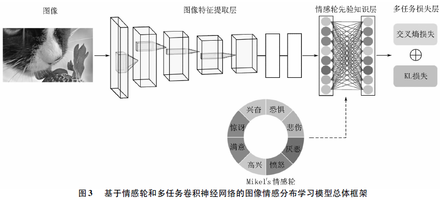
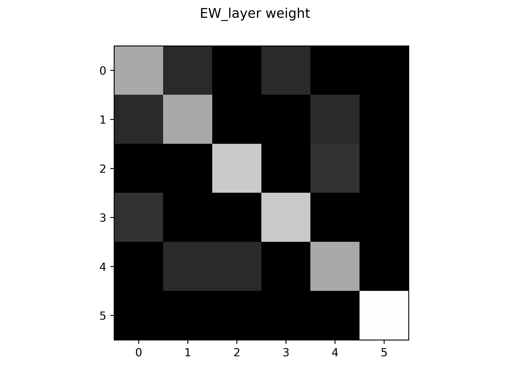

# EW-MTCNN-unofficial

    Unofficial implementation of EW-MTCNN for image emotion classification

----

复现论文： [基于情感轮和多任务卷积神经网络的图像情感分布学习 (2022) 赖金水，万中英，曾雪强](https://lkxb.jxnu.edu.cn/oa/DArticle.aspx?type=view&id=202204006)  
这个论文甚至还有后续破事水 [融合情感轮注意力的情感分布学习 (2023) 陈启凡，曾雪强，左家莉，万中英，王明文](http://cea.ceaj.org/CN/10.3778/j.issn.1002-8331.2108-0356)；或者看 [CSDN博客解读](https://blog.csdn.net/PLANTTHESON/article/details/132912287)  

**结论：能复现出论文数据，但情感轮先验层基本上卵用没用，严重拉低精度还不如没有 🤬**  

⚪ 模型结构

⚪ 情感轮先验层权重

⚪ **训练集**精度 (我懒得做五折交叉了)

⚠ inplace eval on trainset :(

| `-EW` | cls_acc ↑ | sdl_kl ↓ | comment |
| :-: | :-: | :-: | :-: |
| freeze   | 50.101% | 0.5506871 | 冻结情感轮先验层权重 |
| unfreeze | 50.657% | 0.5484301 | 允许情感轮先验层参与微调 |
| none     | **74.949%** | **0.2740831** | 不使用情感轮先验层 |

### references

- 论文
  - 摘要: [https://lkxb.jxnu.edu.cn/oa/DArticle.aspx?type=view&id=202204006](https://lkxb.jxnu.edu.cn/oa/DArticle.aspx?type=view&id=202204006)
  - 下载: [https://lkxb.jxnu.edu.cn/oa/pdfdow.aspx?Sid=202204006](https://lkxb.jxnu.edu.cn/oa/pdfdow.aspx?Sid=202204006)
- Emotion6 数据集 
  - 主页: [http://chenlab.ece.cornell.edu/downloads.html](http://chenlab.ece.cornell.edu/downloads.html)
  - 下载: [http://chenlab.ece.cornell.edu/people/kuanchuan/publications/Emotion6.zip](http://chenlab.ece.cornell.edu/people/kuanchuan/publications/Emotion6.zip)

----
by Armit
2023/12/11 
